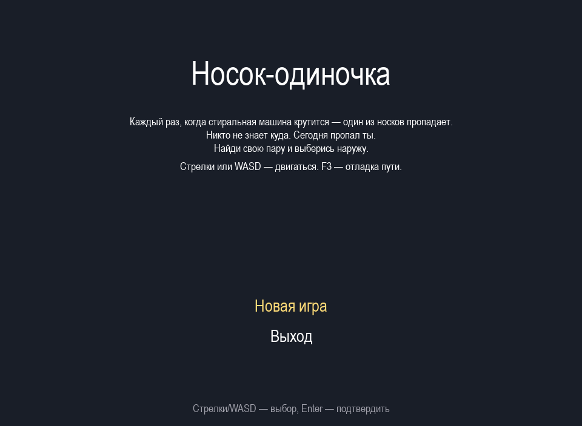
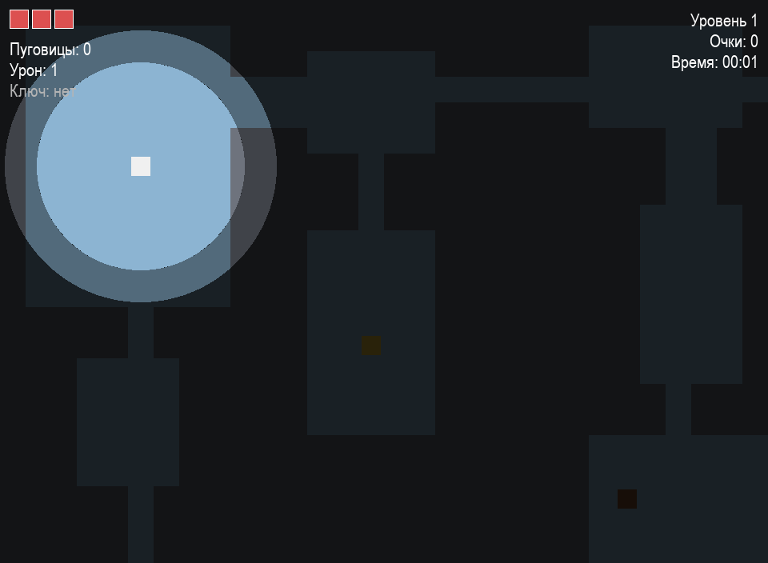
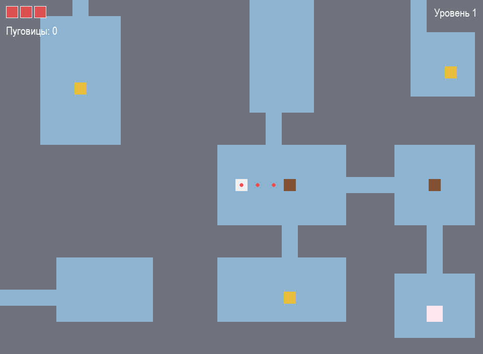

# Носок-одиночка

Маленький top-down roguelike на Python + pygame. Игра про носок, который
потерял свою пару во время стирки и попал в лабиринт труб стиральной
машины. Надо пройти три уровня, собирая пуговицы и убегая от моли,
чтобы найти выход.

Подземелье на каждом уровне генерируется заново алгоритмом BSP, моль
ищет путь через A*.

## Запуск

```
python -m venv venv
venv\Scripts\activate
pip install -r requirements.txt
python main.py
```

## Управление

- Стрелки или WASD — двигать носок
- Enter / Пробел — подтверждать в меню
- F3 — включить отладку (видно путь A* у моли)
- Esc — выйти в меню (прогресс сохраняется)

## Тесты

```
pytest tests/ -v
```

24 теста, проходят примерно за секунду.

## Скриншоты

Главное меню:



Геймплей — носок в подземелье, моль рядом:



Debug-режим (F3) — путь A* виден красными точками:



## Структура проекта

```
src/
  core/         главный цикл, константы, события, ресурсы, ввод
  scenes/       сцены — меню, игра, смерть, победа
  entities/     игрок, моль, пуговица + базовый Entity (ABC)
  systems/      движение, столкновения, ИИ врагов, отрисовка
  algorithms/   bsp_dungeon, a_star
  world/        тайлы, уровень, камера
  ui/           меню, HUD
  persistence/  сохранения в JSON
assets/         звуки и текст сюжета
levels/         пустая папка под возможные пресеты
saves/          сюда падает slot1.json
tests/          pytest, 8 файлов
docs/           описание архитектуры и алгоритмов, UML
```

## Что используется

- Python 3.12
- pygame 2.5.2
- pytest 8.0

Графика — цветные прямоугольники, как рекомендуют в методичке. Сначала
геймплей, потом красивости.
